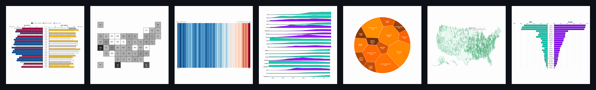

👋 Hey, I’m @juanchiparra.

Information Designer | Audience & Insights analyst | Computational Journalist
- Creating interactive visualizations with [d3](https://d3js.org/) and [Svelte](https://svelte.dev/)🔥
- Building my digital garden with [Astro](https://astro.build/)🌱
- Taking notes with [Obisidian](https://obsidian.md/)📝
- Building something called [Datypical](https://github.com/datypical)❤️
- Developing video games with [Godot Engine](https://godotengine.org/)

I'm currently Automations Team Lead at [DANAConnect](https://www.danaconnect.com/)🤖.

✉️ How to reach me: juanchiparra@gmail.com

  
  
  
  
  

